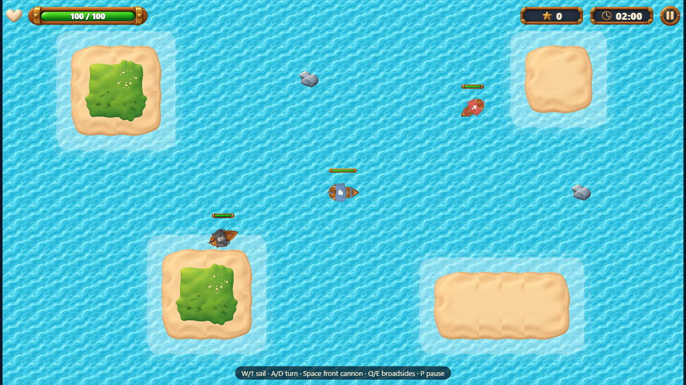

# Pirate Battle

A 2D top-down naval shooter built with **React, TypeScript (strict) and PixiJS**: sail between islands, fight enemy ships and score points before time runs out. Ranking and match history use REST APIs mocked with **MSW**, consumed with **Axios** and **TanStack Query**, and the whole game is tested with **Playwright** and **Vitest**.

Jungle Gaming technical challenge. The original brief is in [challenge/README.md](challenge/README.md) (Portuguese).

- **Live demo:** _to be added after the Vercel deploy_
- **Architecture:** [ARCHITECTURE.md](ARCHITECTURE.md)
- **Requirements, assumptions and rubric:** [docs/REQUIREMENTS.md](docs/REQUIREMENTS.md)
- **Requirement → code → test checklist:** [docs/CHECKLIST.md](docs/CHECKLIST.md)
- **Performance:** [docs/PERFORMANCE.md](docs/PERFORMANCE.md)
- **Test reports:** [docs/reports/](docs/reports/)
- **Asset credits:** [docs/CREDITS.md](docs/CREDITS.md)



## Requirements

- Node.js **22.12 or newer** (tested with Node 24) and npm.
- For E2E tests: Playwright's Chromium (`npx playwright install chromium`).

## Setup

```bash
npm ci
npm run dev            # http://localhost:5173
```

## Commands

| Command                                     | What it does                                                                                          |
| ------------------------------------------- | ----------------------------------------------------------------------------------------------------- |
| `npm run dev`                               | Development server with hot reload (React Strict Mode on).                                            |
| `npm run build`                             | Type-check, then production build into `dist/`.                                                       |
| `npm run preview`                           | Serve the production build on http://localhost:4173.                                                  |
| `npm run lint`                              | ESLint (typescript-eslint strict, React hooks).                                                       |
| `npm run format` / `npm run format:check`   | Prettier write / check.                                                                               |
| `npm run typecheck`                         | `tsc -b` for app, tests and configs.                                                                  |
| `npm test`                                  | Vitest unit and integration tests (simulation, storage, API + MSW).                                   |
| `npm run test:e2e`                          | Builds the e2e bundle, serves it and runs all Playwright tests (desktop + mobile).                    |
| `npm run test:e2e:update`                   | Re-generates the visual regression baselines.                                                         |
| `npm run test:e2e:report`                   | Opens the last Playwright HTML report.                                                                |
| `npm run build:e2e` / `npm run preview:e2e` | Production build **with** test hooks (`dist-e2e/`), served on port 4174.                              |
| `npm run perf`                              | Automated profiling: 3-minute match + 5 memory cycles (needs `npm run build:e2e`; add `-- --headed`). |
| `npm run sync-assets`                       | Re-copies the used assets from `challenge/assets` into `public/assets` (output is committed).         |

## Environment variables

All optional. Copy `.env.example` to `.env.local` to override.

| Variable                 | Default | Purpose                                                                                                                   |
| ------------------------ | ------- | ------------------------------------------------------------------------------------------------------------------------- |
| `VITE_API_TIMEOUT_MS`    | `4000`  | Axios timeout for ranking/history requests. Mock "slow" answers take half of it; "timeout" scenarios take longer than it. |
| `VITE_ENABLE_TEST_HOOKS` | unset   | `true` only in `.env.e2e` (`--mode e2e`): exposes `window.__PIRATE_TEST__`. Never set it for the real build.              |

## Controls

| Action                           | Keyboard             | Touch (landscape)            |
| -------------------------------- | -------------------- | ---------------------------- |
| Sail forward                     | `W` / `↑`            | Up arrow button (left)       |
| Turn left / right                | `A` / `←`, `D` / `→` | Curved arrow buttons (left)  |
| Front cannon (1 shot)            | `Space`              | Middle cannon button (right) |
| Left / right broadside (3 shots) | `Q` / `E`            | Side cannon buttons (right)  |
| Pause / resume                   | `P` or `Esc`         | Pause button (top right)     |

Moving and firing work at the same time, with keys or several fingers. Game keys are only captured during a battle. The game also pauses by itself when the window loses focus, the tab is hidden, or a phone is turned to portrait. Resuming always needs a click or key.

## Gameplay configuration

Everything that affects balancing is in one typed file, [src/game/config.ts](src/game/config.ts). Systems never hardcode numbers, and each match freezes a copy of the config when it starts (changes in Options apply to the next battle).

| Setting                     | Value                                                                                                                                                                   |
| --------------------------- | ----------------------------------------------------------------------------------------------------------------------------------------------------------------------- |
| Game session time (Options) | 60–180 s, default 120 s                                                                                                                                                 |
| Enemy spawn time (Options)  | 1–10 s in steps of 0.5 s, default 3 s                                                                                                                                   |
| Arena                       | 1920×1088 logical px (30×17 tiles), letterboxed to the screen                                                                                                           |
| Player                      | 100 HP, 170 px/s, 2.4 rad/s, collision radius 26 px                                                                                                                     |
| Front cannon                | 25 damage, 500 ms cooldown, 520 px/s, 520 px range, 1.2 s lifetime                                                                                                      |
| Broadside (each side)       | 3 parallel shots × 20 damage, 1.5 s cooldown, 460 px/s, 380 px range                                                                                                    |
| Chaser                      | 40 HP, 150 px/s, rams for 20 damage and explodes (no point)                                                                                                             |
| Shooter                     | 60 HP, 110 px/s, keeps ~300 px away, fires within 380 px (10 damage, 1.8 s cooldown)                                                                                    |
| Spawning                    | first spawn at one interval; first two are one Chaser and one Shooter, then 60 % Chasers; at least 450 px from the player, never on islands; at most 25 enemies at once |
| Score                       | +1 per enemy destroyed by the player                                                                                                                                    |

## Ranking, history and network scenarios

The REST API is mocked by MSW in the browser, in development **and** in the published build:

| Endpoint                                           | Purpose                                                                                                                |
| -------------------------------------------------- | ---------------------------------------------------------------------------------------------------------------------- |
| `GET /api/ranking?page&pageSize&configKey`         | Ranking for one setup (`configKey` like `v1-120s-3s`), sorted by score desc, then duration asc, date asc, matchId asc. |
| `GET /api/players/:playerId/matches?page&pageSize` | The player's matches, newest first.                                                                                    |
| `PUT /api/matches/:matchId`                        | Idempotent registration: 201 when stored, 200 with the existing record when it already exists.                         |

Confirmed records (plus fixtures of other captains) are stored in `localStorage`, so they survive a refresh. Finished matches go to a persisted pending queue **before** being sent, and are retried automatically (on start, when the network comes back, when the scenario changes, every 15 s) or with **Retry** on the result screen.

### Selecting a scenario

- **Panel:** the **Network** button at the bottom left of every menu screen. Pick a scenario, or press **Reset mock data** to go back to the fixtures.
- **URL:** `?scenario=<id>&seed=<n>`, for example `http://localhost:5173/?scenario=timeout-after-save&seed=42`. The choice is remembered until another one is selected.

| Scenario id                           | Behaviour                                                                                                                       |
| ------------------------------------- | ------------------------------------------------------------------------------------------------------------------------------- |
| `success`                             | Normal, fast responses.                                                                                                         |
| `empty`                               | Ranking and history return no rows.                                                                                             |
| `multiple-pages`                      | Extra generated matches, so every list has several pages.                                                                       |
| `slow`                                | Every request takes half the client timeout (2 s by default).                                                                   |
| `variable-latency`                    | Seeded random delay up to 60 % of the timeout.                                                                                  |
| `out-of-order`                        | Every other list request is slow, so older requests answer after newer ones.                                                    |
| `timeout`                             | Every request takes longer than the client timeout.                                                                             |
| `connection-failure`                  | Every request fails at the network level.                                                                                       |
| `client-error`                        | Every request is rejected (400 for lists, 422 for registration).                                                                |
| `server-error`                        | Every request fails with 500.                                                                                                   |
| `ranking-failure` / `history-failure` | Only that list fails with 500.                                                                                                  |
| `timeout-after-save`                  | The server stores the match but answers after the client timeout; the automatic resend gets the existing record (no duplicate). |
| `unavailable-then-recover`            | The first 3 registrations fail with 503, then it works.                                                                         |

### Reproducing failures by hand

Tip: in **Options**, set 60 s and spawn 1 s so a battle ends quickly (or let the enemies sink you).

| What to see                              | Steps                                                                                                                                                                        |
| ---------------------------------------- | ---------------------------------------------------------------------------------------------------------------------------------------------------------------------------- |
| Registration fails, then recovers        | Open `/?scenario=connection-failure`, finish a battle: the result shows "Registration failed" with **Retry**. Switch the panel to **Success**: it is registered immediately. |
| Pending match survives a refresh         | Same as above, but reload with `/?scenario=success#/result`: the queued match is sent on start.                                                                              |
| Timeout after save, no duplicate         | `/?scenario=timeout-after-save`, finish a battle: it ends as "Registered", and Match History shows it once.                                                                  |
| API down at the end, back later          | `/?scenario=unavailable-then-recover`, finish a battle, wait for "failed", press **Retry**.                                                                                  |
| List loading, empty, error               | Open Ranking with `slow`, `empty`, `ranking-failure` or `history-failure`.                                                                                                   |
| Late answers do not overwrite newer data | `/?scenario=out-of-order#/log/ranking`, go to page 2, then quickly Next and Previous: page 2 stays.                                                                          |
| Asset loading failure                    | DevTools → Network → right-click `ships.png` → _Block request URL_, press Play, then unblock and press **Retry**.                                                            |

In failure scenarios Chrome itself prints "Failed to load resource" for the mocked errors. These are network logs, not application errors (every failure is handled).

## Tests

- **Unit/integration (Vitest, `npm test`)**: simulation systems (movement, collisions, weapons, projectiles, AI, spawn, scoring, end conditions, determinism), input, storage, pending queue, mock DB rules, and the real Axios client against the real MSW handlers for every scenario.
- **E2E (Playwright, `npm run test:e2e`)**: the 12 areas of the brief, on Chromium desktop and on a Pixel 7 in landscape (main flows), plus visual regression of the menu, a seeded frozen arena and the result screen. Every test starts from a clean context with a known seed and network scenario, and fails on unexpected console errors. Reports: HTML report and traces of failures.
- **Test instrumentation**: the e2e build exposes `window.__PIRATE_TEST__` (state, freeze/step/advance of the simulation clock, seed, balancing overrides, enemy placement). Combat tests press real keys and touch real buttons; they never change health, score or positions. The normal build does not contain this code.
- Visual baselines are platform-specific (`*-win32.png`). On another OS run `npm run test:e2e:update` once.

## Project structure

```
src/
  app/            App shell, hash router, match record creation
  game/
    config.ts     all balancing + option limits (typed)
    simulation/   pure rules: Match, systems/, geometry, RNG, fixed-step clock
    render/       PixiJS: stage, arena, ships, health bars, effects
    input/        keyboard + touch -> InputState
    audio/        Web Audio engine and event-driven sounds
    perf/         ?perf metrics overlay data
    GameSession.ts  glue: loop, pause, restart, teardown
    bridge.ts       HUD store for React (useSyncExternalStore)
    testHooks.ts    e2e-only instrumentation
  api/            contracts, Axios client, TanStack Query hooks, pending queue
  mocks/          MSW handlers, mock DB, fixtures, scenarios
  storage/        localStorage (options, player, last result, audio)
  ui/             React screens, components, HUD, dialogs
tests/unit/       Vitest
tests/e2e/        Playwright
scripts/          asset sync, profiling
docs/             requirements, checklist, performance, reports, credits
```

## Main assumptions

The brief leaves some choices open. The full list (A1–A40) is in [docs/REQUIREMENTS.md](docs/REQUIREMENTS.md#ambiguities-and-assumptions). The most visible ones:

- Supported mobile orientation: **landscape**; portrait shows "Rotate your device" and pauses.
- Spawn interval limits: **1–10 s** in steps of 0.5 s. Session time 60–180 s, default 120 s / 3 s.
- One ranking entry per match; the ranking shows the setup chosen in Options. Tie-break: score, duration, date, matchId.
- A Chaser that rams the player explodes without scoring; enemy shots pass through other enemies; ships push each other apart.
- The first two spawns are one Chaser and one Shooter, so both types always appear; at most 25 enemies at once.
- "Time played" is active time (pauses excluded). Leaving a battle or reloading abandons it (nothing is registered).
- The captain's name is editable in Options and stored with a local player id.

## Deployment (Vercel)

The repository is ready for Vercel ([vercel.json](vercel.json)): framework Vite, `npm ci`, `npm run build`, output `dist/`. The mock service worker (`/mockServiceWorker.js`) is served without caching, so the published game always runs the mocks. Routing uses URL hashes, so any static host works; the rewrite to `index.html` only covers direct visits to unknown paths.
